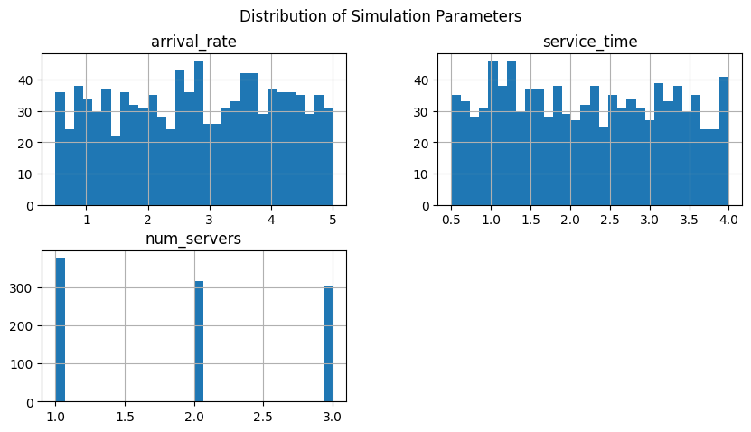
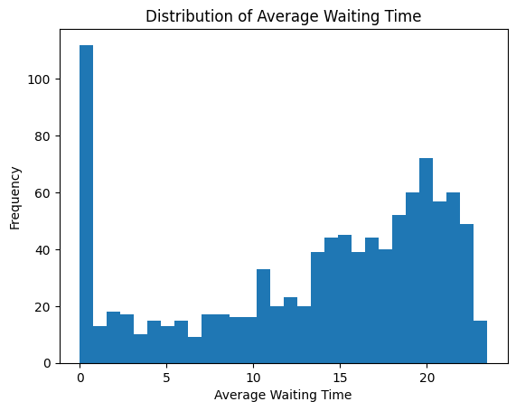
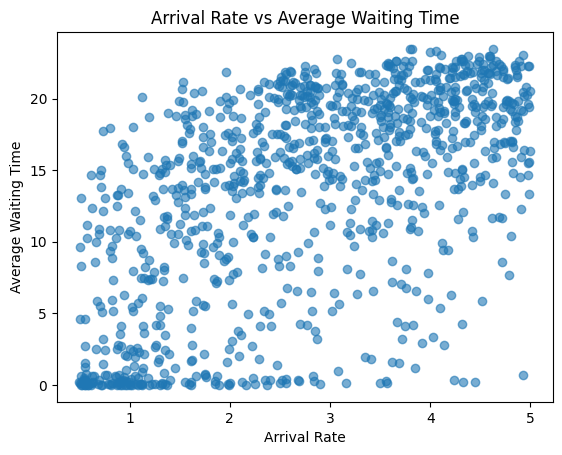
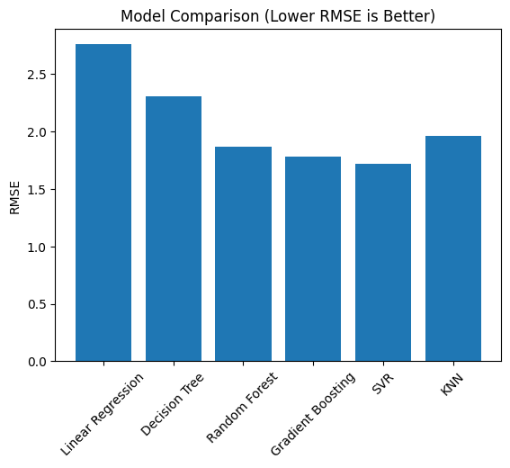
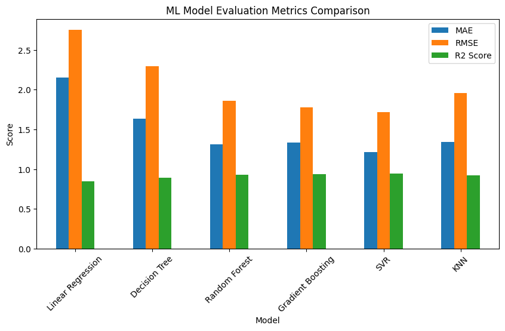
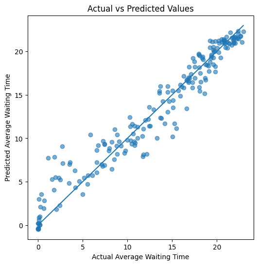

# Data Generation using Modelling and Simulation for Machine Learning

## Overview

This project demonstrates how simulation-based modelling can be used to generate synthetic data for machine learning applications. A discrete-event simulation is built using the **SimPy** library to model a queueing system. The generated simulation data is then used to train and compare multiple machine learning regression models.

---

## Simulation Tool Used

**SimPy** is an open-source, Python-based discrete-event simulation framework. It is suitable for modelling systems where events occur over time, such as queues, service systems, and resource-sharing environments. In this project, SimPy is used to simulate customer arrivals and service processes in a multi-server queue.

---

## Installation and Environment

The project is implemented in **Google Colab**. Required libraries are listed in `requirements.txt`:

```
simpy
numpy
pandas
matplotlib
scikit-learn
seaborn
```

---

## Simulation Model Description

The simulation models a queueing system with the following components:

- Customers arrive randomly following an exponential inter-arrival time.
- A fixed number of servers provide service.
- Each customer waits until a server becomes available.
- The key output of the simulation is **average waiting time**.

### Simulation Parameters and Ranges

| Parameter      | Description                      | Range          |
|----------------|----------------------------------|----------------|
| arrival_rate   | Customer arrival rate            | 0.5 – 5.0      |
| service_time   | Service time per customer        | 0.5 – 4.0      |
| num_servers    | Number of servers                | 1 – 3          |

---

## Data Generation Methodology

Random values are sampled within the defined parameter ranges and passed to the simulation model.

- Each simulation run produces one output value (average waiting time).
- A total of **1000 simulations** are executed.
- The generated dataset is stored as a CSV file.

**Dataset location:** `data/simpy_dataset.csv`

---

## Exploratory Data Analysis

### Statistical Summary

The generated dataset contains 1000 samples. Below is a summary of the main statistics for the simulation parameters and output.

(See notebook for detailed summary using `df.describe()`.)

---

### Distribution of Simulation Parameters

This plot shows how input parameters were randomly sampled across their ranges.



---

### Distribution of Average Waiting Time

This histogram shows how the average waiting time varies across different simulation runs.



---

### Arrival Rate vs Average Waiting Time

This scatter plot illustrates the relationship between arrival rate and average waiting time.



---

## Machine Learning Models

The generated dataset is used to train and evaluate the following regression models:

- Linear Regression
- Decision Tree Regressor
- Random Forest Regressor
- Gradient Boosting Regressor
- Support Vector Regressor (SVR)
- K-Nearest Neighbors (KNN)

**Input features:**
- arrival_rate
- service_time
- num_servers

**Target variable:**
- avg_wait_time

---

## Model Evaluation Metrics

Models are evaluated using:

- Mean Absolute Error (MAE)
- Root Mean Squared Error (RMSE)
- R² Score

### Model Comparison (RMSE)

Lower RMSE indicates better predictive performance.



---

### Comparison Across All Metrics

This plot compares models across MAE, RMSE, and R² score.



---

### Actual vs Predicted Values

This plot visualizes prediction accuracy of the best-performing model.



---

## Results and Discussion

- Ensemble and kernel-based models (SVR, Random Forest, Gradient Boosting) perform significantly better than linear regression.
- The simulation-generated dataset captures meaningful relationships between input parameters and waiting time.
- Simulation-based data generation proves effective for training machine learning models when real data is limited or unavailable.

---

## Conclusion

This project demonstrates a complete pipeline for:

- Simulation-based data generation
- Dataset creation using modelling
- Machine learning model training and comparison

The results show that simulation can be a powerful tool for generating realistic datasets for machine learning applications.

---

## How to Run the Project

1. Open the notebook in Google Colab
2. Install required libraries
3. Run all cells sequentially
4. Generated dataset and plots will be created automatically

---

## Project Information

**Author:** Prabhsimar Singh  
**Roll No.:** 102483078  
**Course:** UCS654 – Predictive Analytics using Statistics  
**Institute:** Thapar Institute of Engineering & Technology

---

## License

This project is created for academic purposes.
